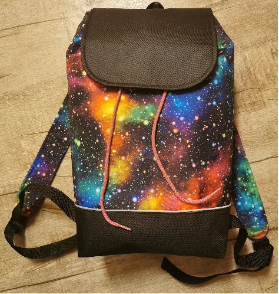

# VÝPOČET CENY MATERIÁLU NA BATOH OSKAR

Základní informace ke střihu na batoh Oskar:

## VHODNÉ LÁTKY:

- kočárkovina (=lehce nepromokavý "šusťák"), kepr, dekorační látky, kanvas, manžestr, riflovina...
- podšívka - bavlněné plátno

## SPOTŘEBA MATERIÁLU:

- vnější látka - 50cm x 140cm
- podšívka - 50cm x 140cm
- výztuha - ronolin 140g/m (případně žehlící ronofix, slabší ronolin) 100x80cm
- 1x magnetické zapínání
- 2x průvlek žebříček plastový se zpětnou brzdičkou
- 270 cm popruhu POP nebo bavlněného

V průběhu šití zjistíte, že u některých materiálů zbyde i docela velký kus, který je možno použít na jiné produkty. Po zadání základních informací do programu bude vypočtena cena za skutečně použitý materiál.

Pro správnou funkci je nutné zadat:
- cenu látky a výztuhy za běžný metr (bm) a její šíře, tato data se využijí pro výpočet ceny za $m^2$ a z této částky se přepočte cena za použité množství
- u dalších komponent stačí zadat jednotkovou cenu (za kus, metr, ...) a program vypočtě konečnou cenu dle potřebného množství
